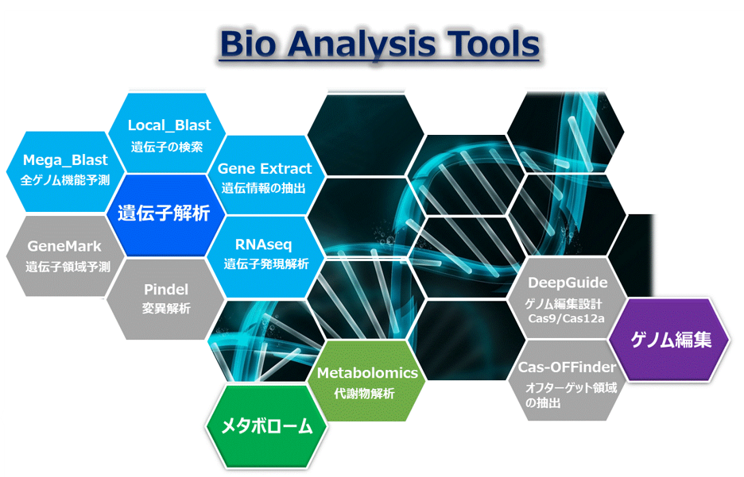
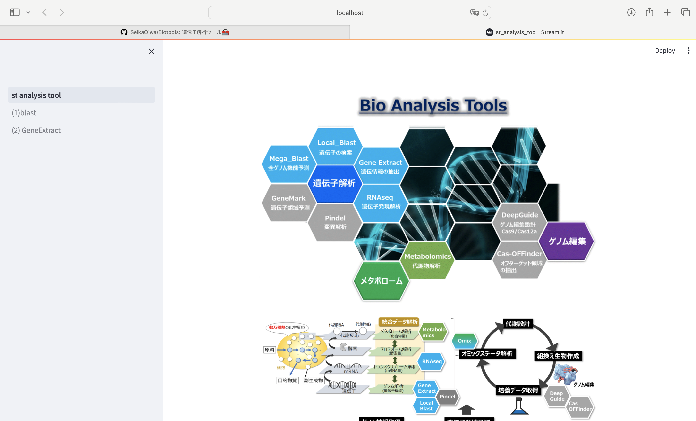

# Biotools
遺伝子解析ツール🧰

# 1. 概要

標準的な遺伝子解析ツールをstreamlitを用いてwebアプリ化

# 2. コンテンツ

(1) Local_blast

   blast検索実行ツール

(2) GeneExtract

   ゲノムデータから、遺伝子番号や染色体位置情報に該当する配列を抽出するツール

(3) RNAseq

   RNAseqデータ解析ツール

# 3. 環境構築

(1) モジュールインストール

`conda create -n biotools python`

`conda activate biotools`

`conda install biopython`

`conda install -c bioconda blast`

`conda install numpy`

`conda install conda-forge::matplotlib`

`conda install -c bioconda -y fastp`

`conda install -c bioconda hisat2`

`conda install -c bioconda samtools`

`conda install -c bioconda subread`

`conda install bioconda::gffread`

`pip install Pillow`

`pip install openpyxl`

`pip install streamlit`

(2) gitから解析フォルダダウンロード

`git clone https://github.com/SeikaOiwa/Biotools.git`

# 4. 起動方法

(1) git cloneでダウンロードした`Biotools`(フォルダ)に移動

`cd /**/**/Biotools`

(2) conda環境に入り、streamlitを動かす

`conda activate biotools`

`streamlit run st_analysis_tool.py`

(3) ローカルホスト上に下図のwebアプリが表示される。

# 注意！　samtoolsエラー対応

以下のエラーが出る場合は、fileフォルダ内のlibcrypto.1.0.0.dylibをenv/biotools/lib/に格納

　　--- error message --- 　　samtools error（Library not loaded: @rpath/libcrypto.1.0.0.dylib）